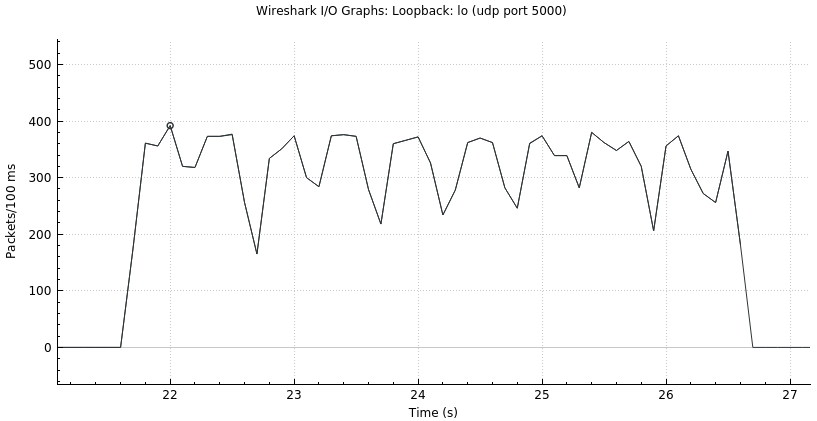
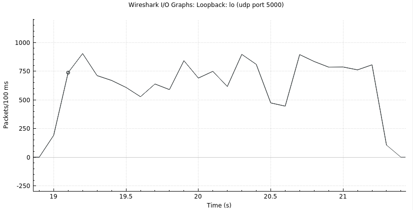
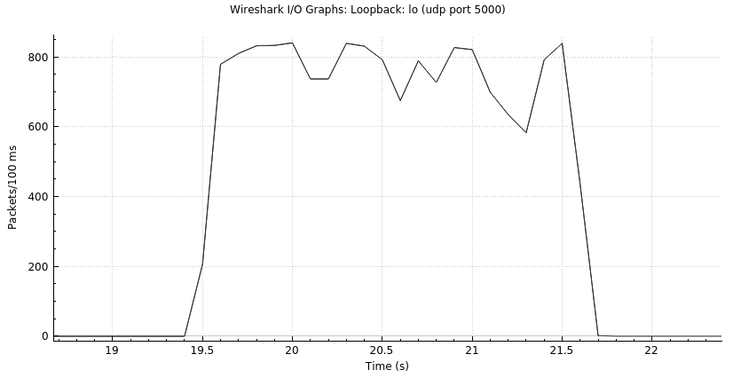
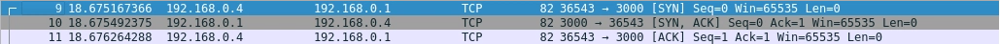
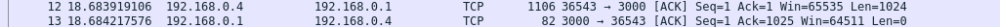
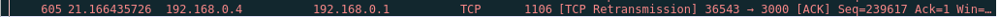
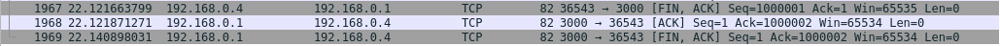

# ip-tcp-kenta-josh

## Measuring our TCP-in-UDP implementation performance
To test our file transfer speed, we conduct three different tests. The file that is going to be transferred is going to be `./test_files/hugeRead` which has `8218784` (8.21..megabytes) bytes in it.

Since this is using the loopback, the speed totally depends on the CPU that the binary is being executed. Hence we also provide the hardware information:

- Processor: __Intel(R) Core(TM) i5-1035G7 CPU @ 1.20GHz   1.50 GHz__
- System Type: __64-bit operating system, x64-based processor__

### 1. Between Reference Implementation 
- t_start = `21.714389771`
- t_end = `26.647592358`
- file_size =  `8218784`
- Throughput = file_size / (t_end - t_start) = `1666013.8834878139` bytes



### 2. Between our Implementation
- t_start = `19.052632940`
- t_end = `21.312483116`
- file_size = `8218784`
- Throughput = file_size / (t_end - t_start) = 
`3636871.190526216`



### 3. Between our Implementation using Tahoe (Congestion Control)
- t_start = `19.572265284`
- t_end = `21.658868400`
- file_size = `8218784`
- Throughput = file_size / (t_end - t_start)
= `3938834.3365245904`



## TCP Packet Capturing
We sent a 1 mb file from node C to node A, with node's B packet loss rate set to 2%. The capture can be found [here](./docs/tcp/pac_cap1.pcapng). We did not see any issues.
### The 3-way handshake


- SYN packet [`#9`]
- SYN, ACK packet [`#10`]
- ACK, packet [`#11`]
- This is an expected 3-way handshake behavior
### Segment sent and acknowledged


- Segment sent from node C [`#12`]
- Corresponding ACK from node A [`#13`]
- The Sequence number and the ACK number makes sense
### Segment that is retransmitted


- Retransmitted segment from node C [`#605`]
- It is retransmitted because of the previous ACK we receive. So it is expected.
### Connection teardown


- Fin, ACK from node C to node A [`#1967`]
- ACK from node A to node C [`#1968`]
- Fin, ACK from node A to node C [`#1969`]
- This is the expected behavior of the connection teardown

## TCP Packet Capturing with Congestion Control
### Drop-free network
We did the same and sent a 1 mb file from node C to node A, with no drop, but using the tahoe congestion control algorithm. The capture can be found [here](./docs/tcp/pac_cap_cc_no_drop.pcapng).
In this scenario, the sending starts off slow and then increases due to the slow start mechanism. This is a weakness in a drop free environment since there are no losses, so there is no need to throttle the speed at the beginning. This potentially one scenario where a congestion control algorithm will work less optimally than a normal node.

This ramp up time cannot be seen in the sequence of packets, but can be seen in the packet graph


### Lossy node
We sent the same file from node C to node A, with node's B packet loss rate set to 2%, but using the tahoe congestion control algorithm. The capture can be found [here](./docs/tcp/pac_cap_cc_with_drop.pcapng).

The most significant advantage of the tahoe congestion control algorithm when it comes to improving speed is fast retransmission. We can see here that once there are 3 duplicate acks, there was an immediate retransmission [`#94`] by the sender (and this was also detected by wireshark as a fast retransmit)


### Lossy node with simultaneous streams
We sent the same file from node C to node A, with node's B packet loss rate set to 2%, using the tahoe congestion control algorithm. This time, we also made 2 simultaneous other streams that are not using the congestion control algorithm. The capture can be found [here](./docs/tcp/pac_cap_cc_with_simult.pcapng).

The socket with the congestion control algorithm was able to be much faster in sending data of the same size, and was using a lot more throughput. We can observe this from the packet capture, similar to the lossy node packet capture, that there are fast retransmissions taking place, such as in [`#3599`]. We can also see that there are more instances of window full for the non congestion control algorithms such as in [`#1771`]. This is because with fast retransmission, the socket with the congestion control algorithm immediately sends the missing packet, without waiting for the timeout, as described in the previous packet capture. This allows the receiver to not only receive the packets it missed faster, but also allows it to clear its receiving window faster, allowing the sender to send more packets faster. 


## Design decisions (TCP)


## Design decisions (IP)
### Link layers
Our link layers are abstracted into ExternalInterface structs and the definition can be found in pkg/link. It contains all the necessary information for a link layer, such as the IP addresses and the udp connection. We also provide two helper functions, one being ForwardPacket, which abstracts away the process of sending a packet over that particular link layer, and RequestRouting which carries out the RIP request process. 

### Thread model
Our main routine will spin up 4 goroutines:

1. UDP listener routine. This routine would listen for packets send via the UDP connection. 
2. RIP protocol sender. This routine handles the periodic sending of RIP updates.
3. Start command line. This routine handles the reading and handling of command line inputs. 
4. Refresh table. This routine acts as a background cleanup routine which will remove expired hops from the routing table. We do not rely on this routine to immediately remove any expired hops, we check the validity of a hop when it is being used, but this background cleaner helps us keep a clean table for printing. 

We have several important channels for communication between routines:

1. IP packet channel. Packets received through the UDP listener routine will be send through this channel and we handle these packets in the main routine. 
2. The print channel. We need to print when we are either handling incoming ip packets, or as a result of command line inputs. To prevent merged print messages, we make sure that only the main routine is printing messages. Hence, the main routine reads from the print channel and carries out the printing. Using the golang's select, printing printChan messages and handling packets happens synchronously. 
3. We have a channel called Traceroute channel, for the traceroute feature where we require the ip packet handler to communicate with the command line go routine. 

### How IP packets are processed

1. The UDP listener routine receives an incoming IP packet. 
2. It unmarshals the IP packet into our own data structure, and sends it through the IP packet channel.
3. The main routine reads from this IP packet channel and calls the handleIpPackets function. 
4. This function first validates the packet based on its TTL and checksum, handling any failures appropriately.
5. If the IP packet is for the local node, we call a helper function on our InternalInterface struct that will lookup the handlers based on the protocol of the IP packet, and handle it appropriately.
6. If the IP packet is not for the local node, we use the helper functions of our routing table struct to forward the packet appropriately.

## Other notes
No known bugs. We developed using the container environment.

## Running
at the root of this repository,

```
make clean
make //this will create node binary at the root directory

./run_net ./node ./lnx/[AB, ABC, or loop]
```
the above command will initializ a tmux program with split terminals

### Adding .lnx files
Under ./lnx, you can add a folder XYZ. Then, under XYZ, create .lnx files 
with relevant information.
You can test the net with
```
./run_net ./node ./lnx/XYZ
```

### Reference Implementations
All references are stored under ./reference/
