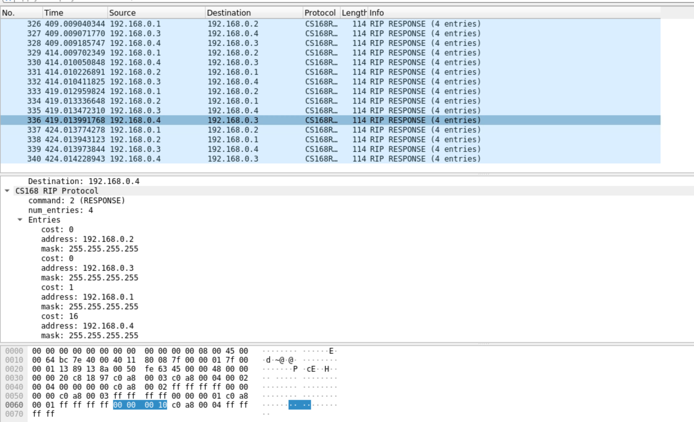

# Packat Capture Image (using our own node binary)

# Lab Questions 
1. What node sent this RIP update? To which node was it sent?
- The header tells us that the packet was sent from port 5001 to port 5002. Which means Router B sent this RIP packet to Router C
2. What entries are sent in the update? Do you observe instances of split horizon/poison reverse?
- The entries of B's forwarding table is sent. We can see that the first two entries have cost 0 since those are B's IP addresses. Then we see another entry to Router A. The cost is 1 since A <-> B is 1. The last entry is B <-> C. Since B learned about this from C, we apply Split Horizon with Poisionsed Reverse to represent unreachability to C via B solely.